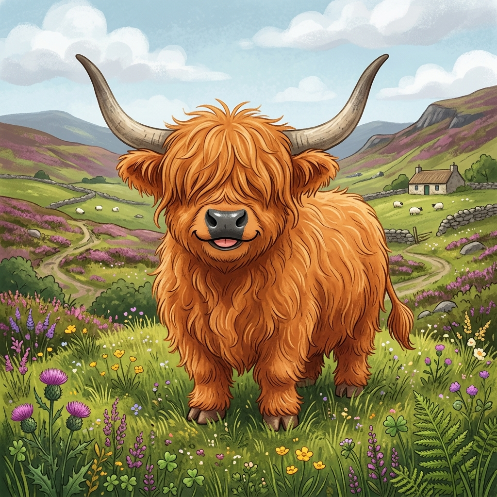

# Highland Cal 🐮📅

Welcome to **Highland Cal**! 🎉

*Wait, did you say Highland **Cow**? 🐄 Nope, it's Highland **Cal** (short for Calendar)!\nThough to be fair, they both love a good grassy field and are absolute units of Scottish awesomeness. 🏴󠁧󠁢󠁳󠁣󠁴󠁿*

## Project Overview

Highland Cal (project code name CaberTrack) is a web application designed to coordinate attendance and interest levels for Highland Games athletes.\nThrowing heavy things in kilts has never been so flawlessly organized! 🪵💪

The system follows a decentralized open-source/self-hosted model where individual throwing clubs can deploy their own isolated instances. This allows clubs to easily manage their athletes, track competition classes, and coordinate athlete attendance for various Highland Games.

### Key Features
- **Decentralized Self-Hosting:** Each club maintains its own instance using Vercel and Supabase.
- **Federated Authentication:** All authentication is handled securely via Google OAuth 2.0 (Zero Password Policy).
- **Games & Attendance Tracking:** Keep track of Highland Games dates, locations, registration URLs, and coordinate athlete attendance and interest levels.
- **Row Level Security (RLS):** Ensures athletes can securely modify their own attendance records.

### Tech Stack
- **Frontend:** Next.js (React)
- **Hosting:** Vercel
- **Database:** Supabase (PostgreSQL)
- **Authentication:** Google Auth

## Deployment
You can deploy your own instance of Highland Cal using the "Deploy to Vercel" button. Detailed setup processes for Google OAuth will be provided so non-technical users can quickly get up and running.